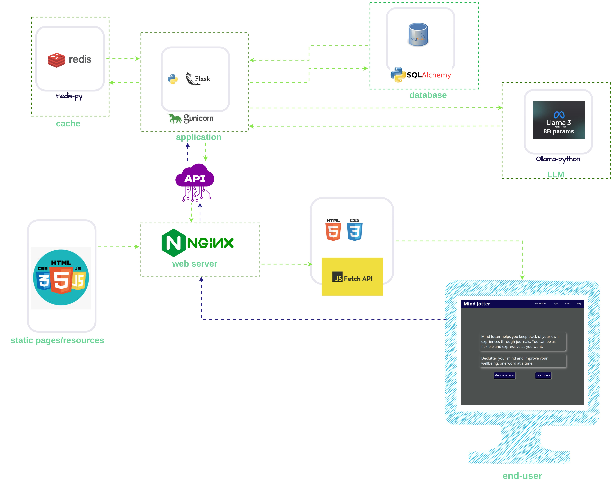
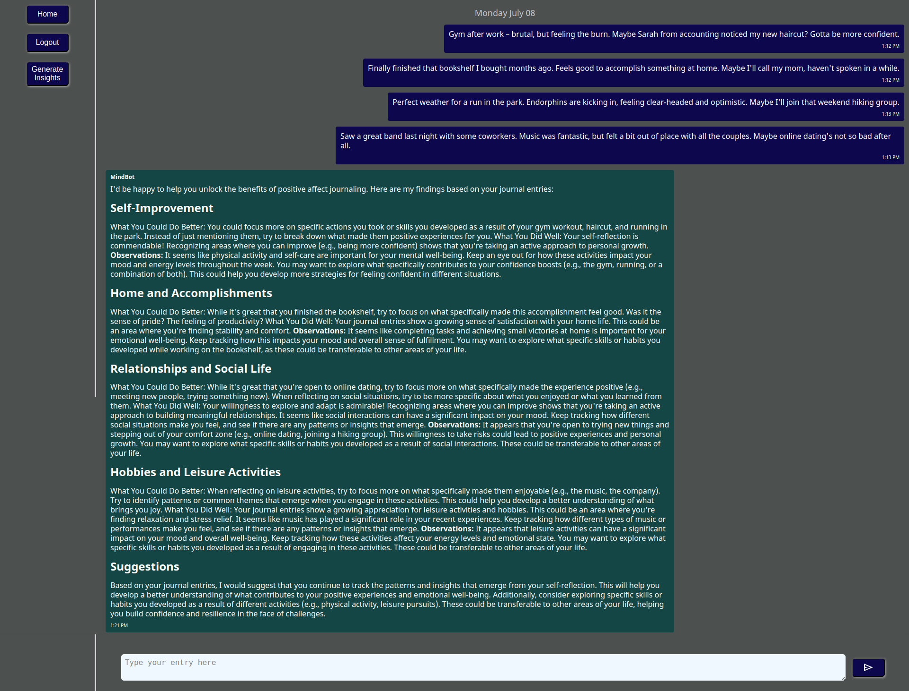

# MindJotter
MindJotter is a web-based journaling application that enables users to write personal journals anytime. MindJotter aims to enable users to develop more positive state of mind and mitigate mental distress through journaling.
MindJotter leverages best-in-class large language model (llama3 7B) to generate meaningful insights for users, based on their journal entries.

# Motivation Behind MindJotter
I built MindJotter to give everyone a tool for reflective/positive affect journaling. From personal experience, writing is
very beneficial to personal development and mental clarity. One other major motivation behind this project is the [findings of researchers
at Pennsylvania State University](https://www.ncbi.nlm.nih.gov/pmc/articles/PMC6305886/) on the benefits of Positive Affect Journaling (PAJ) to medical patients. I believe that journaling can be beneficial to everyone,
not just medical paitents. This project is part of my effort to give everyone a tool to unlock those benefits.

# Technologies Used
### Frontend:
- HTML, CSS, Javascript
### Backend:
- **Storage**: MySQL, Redis
- **Webserver**: Nginx
- **Application**: Python Flask Framework (API service)
- **Application server**: Gunicorn
- **LLM and Tools**: llama3 (8B params), ollama
- **Others**: SQLAlchemy ORM

# Application Components
Below is a schematic of the application components and structure.

# Demo
[Here is a link](https://www.veed.io/view/e1b6d471-62b9-4a9f-ad12-b6117553bece?panel=share) to a demo video of the application.

The result of the insight generation from the video demo, along with the journal entries are shown below.

